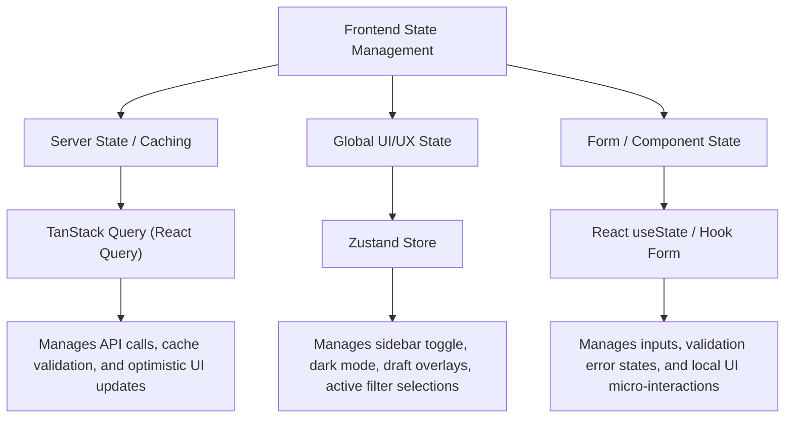

# Frontend Architecture Specification
## Fact+Pulse Delivery Governance Operating System

---

## 1. Overview
Fact+Pulse is built as a responsive, dashboard-first web application. The frontend uses **Vite + React** as the foundation, leveraging React Router DOM for SPA routing, Tailwind CSS, and shadcn/ui to provide an executive-level command center interface.

### Technical Stack
*   **Framework:** React 19 + Vite 8
*   **Routing:** React Router DOM v7 (SPA routing with route guards)
*   **Language:** TypeScript (Strict Mode)
*   **Styling:** Tailwind CSS v4 (configured via CSS variables, using utility classes for dark mode and responsive layouts)
*   **Component Library:** shadcn/ui (Radix UI primitives under the hood)
*   **Data Fetching & Cache:** TanStack Query (React Query)
*   **Global Client State:** Zustand (for auth, theme selection, and layout switches)
*   **Forms & Validation:** React Hook Form & Zod
*   **Date Formatting:** date-fns

---

## 2. Directory Structure
The frontend project follows a highly organized, modular React + Vite directory layout inside the `src/` folder:

```
src/
├── assets/                # App-specific assets (global styling, etc.)
├── components/            # Reusable UI component blocks
│   ├── ui/                # UI primitives (buttons, modals, dialogs)
│   ├── layouts/           # Common wrappers (Sidebar, TopHeader, Container)
│   ├── dashboard/         # Widgets and summaries
│   ├── charts/            # Recharts data visualizers
│   ├── forms/             # Input forms with validation
│   └── ai/                # AI markdown editors & checkers
├── hooks/                 # React Query custom hooks (API communication)
│   ├── use-accounts.ts
│   ├── use-governance.ts
│   ├── use-ai-workspace.ts
│   └── use-stakeholders.ts
├── pages/                 # Routing pages
│   ├── landing/           # Landing page
│   ├── login/             # Login page
│   ├── portfolio/         # Portfolio page
│   ├── accounts/          # Account page
│   ├── buying-centers/    # Buying Center page
│   └── projects/          # Project page
├── routes/                # Router configuration & route guards
│   └── index.tsx          # React Router DOM layout and route paths
├── services/              # Base services
│   ├── api-client.ts      # Axios client with interceptors
│   ├── mcp-client.ts      # Model Context Protocol integration layer
│   └── local-mock.ts      # Mock server hooks (development / demo)
├── store/                 # Zustand global client states
│   ├── auth-store.ts      # User sessions & roles
│   ├── ui-store.ts        # Sidebar state, theme, modal triggers
│   └── draft-store.ts     # AI draft editor temporary workspace state
├── types/                 # Unified TypeScript interfaces
│   ├── api.d.ts           # API interfaces (Request / Response)
│   └── index.d.ts         # Common entities (Account, Project, Stakeholder)
├── App.tsx                # Base application element
├── App.css                # App-specific layout overrides
├── index.css              # Global styles, variables, Tailwind directives
└── main.tsx               # Client entry point
```

---

## 3. Routing & Pages Design
Routing maps directly to the navigation requirements of the Executive Command Center:

| Route Path | Dashboard View | Primary Persona | Core Functionality |
| :--- | :--- | :--- | :--- |
| `/` | Landing Page | Public | Welcome screen & general introduction. |
| `/login` | Login Page | Public | Google Workspace SSO simulation. |
| `/portfolio` | Portfolio Dashboard | Executive, Account Lead | High-level account cards, portfolio RAG health tracker, compliance trends. |
| `/accounts/:accountId` | Account Dashboard | Account Lead | Buying centers, interactive status Heatmap Summary Bar, staffing score progress bars, overall project RAG states, stakeholder sentiment scores, and automated reports. |
| `/buying-centers/:centerId` | Buying Center Dashboard | Account Lead | Stakeholder hierarchy charts, connect frequency tracker, and contact cards. |
| `/accounts/:accountId/projects/:projectId` | Project Dashboard | Delivery Lead | Detailed project governance check-gate activities, risks lists, action items, and upload widget with dynamic RAG recalculation. |
| `/ai-workspace` | AI Governance Workspace | Delivery Lead, Account Lead | Upload artifacts, select draft types (Weekly Notes, WBR, digest), select timeline ranges, view styled HTML drafts, switch preview/code tabs, download PDF, approve, and export. |

---

## 4. State Management
Fact+Pulse separates client state into three distinct layers to ensure clean code separation:



### Server State (TanStack Query)
All data-fetching, caching, mutation, and synchronizations are managed via queries:
*   Queries cache details with specific TTL (e.g., dashboard graphs cache for 1 minute; configurations cache for 10 minutes).
*   Mutations (e.g., uploading a document or changing stakeholder sentiment) trigger target cache invalidations (e.g., invalidating `['project', projectId]` cache keys).

### Client UI State (Zustand)
Used purely for client-only parameters that are shared across component sub-trees, such as:
*   Sidebar collapsed/expanded state.
*   Theme selection (Light/Dark).
*   AI workspace editor draft selections.

---

## 5. MCP (Model Context Protocol) Integration Hook
To support Factspan's future vision of MCP integration, the frontend embeds a decoupled client-side abstraction:
*   **Abstraction Layer:** `src/services/mcp-client.ts` exposes API bindings that send commands to the NestJS backend's MCP integration layer.
*   **UI Components:** The frontend renders action buttons (e.g., "Draft Email in Gmail via MCP", "Sync to Google Drive via MCP") which map to backend endpoints. These trigger server-side MCP tools connecting Google workspace APIs.

---

## 6. Rendering and Layout Architecture
*   **Root Layout & Theme Wrapper:** Configured in [main.tsx](file:///Users/sahiljaryal/Documents/FACTSPAN/FACTPULSE_FE/src/main.tsx) and [App.tsx](file:///Users/sahiljaryal/Documents/FACTSPAN/FACTPULSE_FE/src/App.tsx). Subscribes to the Zustand global `useUIStore` to apply class-based theme injection (`.dark` on `<html>` and `<body>`) and manages the theme provider.
*   **App Layout Wrapper:** Every dashboard page is wrapped in an administrative dashboard frame including a Collapsible Left Sidebar, Page-specific Top Breadcrumbs Header, and the Content Scroll Pane.
*   **Extreme Responsive System (250px - 4K TV):**
    *   `4k-tv` (>= 3840px): Ultra-scale layout. Margins, text sizes, cards, and container maximum widths scale up (e.g. `4k-tv:max-w-[800px]`, `4k-tv:text-6xl`) to avoid floating layouts and tiny text on massive TV boards.
    *   `4k` (>= 2560px): QHD scaling viewport adjustments.
    *   `3xl` (>= 1920px) to `2xl` (>= 1536px): Wide desktop monitors layouts.
    *   `xl` (1280px) to `lg` (1024px): Standard laptops with visible sidebars.
    *   `md` (768px) to `lg` (1024px): Medium screens; navigation sidebars collapse to icon-only.
    *   `sm` (640px) to `md` (768px): Small tablets; navigation panel shifts to popover triggers.
    *   `xs` (250px) to `sm` (640px): Extreme mobile viewports. Layouts collapse to a single high-contrast vertical stack, input sizes reduce (`px-3 py-2 text-xs`), and margins minimize to preserve layout integrity down to 250px.
*   **Dark Mode Standard:**
    *   Mandates the use of Tailwind's `dark:` modifier on all elements (e.g., `bg-white dark:bg-neutral-900`, `text-neutral-900 dark:text-white`).
    *   Any new UI components created *must* define both light and dark classes explicitly. Semicolons and styling must align with Prettier.
