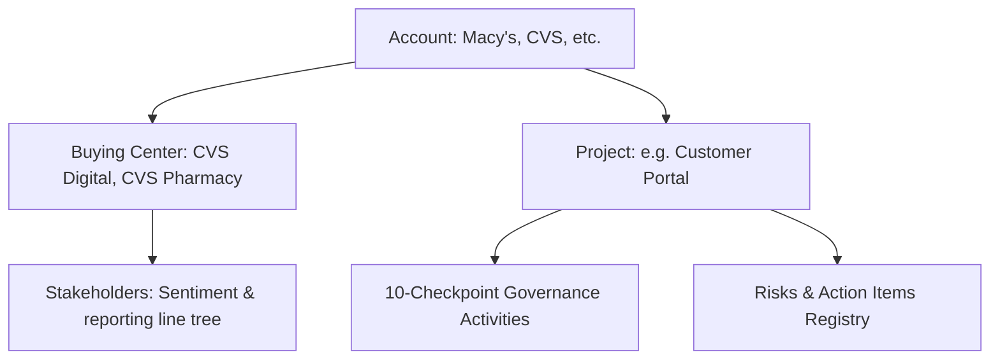

# Repository Context & Onboarding Guide

## Fact+Pulse Delivery Governance Operating System – Frontend

This document provides a comprehensive technical overview and developer onboarding context for the **Fact+Pulse Frontend** repository. It serves as a guide for developers and AI agents to understand the workspace layout, core domain models, technical stack, routing, state management, design tokens, and testing protocols.

---

## 1. Project Overview

**Fact+Pulse** is a responsive, dashboard-first web application designed as an **Executive Delivery Command Center**. Its primary goal is to centralize delivery information, monitor governance compliance, track stakeholder engagement/sentiment, and reduce reporting overhead through AI-assisted document generation.

### Target Personas

1. **Account Lead (Primary):** Needs high-level account status, compliance scores, and stakeholder relationship health in seconds.
2. **Delivery Lead (Secondary):** Responsible for uploading governance artifacts, tracking checkpoint activities, and reviewing/publishing AI-generated drafts.
3. **Executive Leadership:** Monitors overall portfolio health, high-risk accounts, and governance compliance trends.

---

## 2. Directory Structure

The frontend project follows a React + TypeScript structure built with Vite:

```
FACTPULSE_FE/
├── docs/                      # Technical specification documents
│   ├── PRD.md                 # Product Requirements Document
│   ├── ARCHITECTURE.md        # Frontend Architecture specifications
│   ├── DATABASE.md            # Client-side data models and query keys
│   ├── API_SPEC.md            # API endpoints & client-side axios specifications
│   ├── UI_UX.md               # Theme tokens, breakpoints & screen wireframes
│   ├── TASKS.md               # Phase-wise development tasks & roadmap
│   └── TESTING.md             # Testing specification and CI checklist
├── public/                    # Static assets (images, icons)
├── src/
│   ├── assets/                # App-specific assets (global styling, etc.)
│   ├── components/            # Reusable UI component blocks
│   │   ├── ui/                # UI primitives (buttons, modals, dialogs)
│   │   ├── layouts/           # Common wrappers (Sidebar, TopHeader)
│   │   ├── dashboard/         # Widgets and summaries
│   │   ├── charts/            # Recharts data visualizers
│   │   ├── forms/             # Input forms with validation
│   │   └── ai/                # AI markdown editors & checkers
│   ├── hooks/                 # React Query custom hooks (API communication)
│   ├── pages/                 # Routing pages (Landing, Login, Portfolio, Accounts, etc.)
│   ├── routes/                # Router configuration & route guards
│   ├── services/              # Base services (Axios client, MSW mocks, MCP bindings)
│   ├── store/                 # Zustand global client states (Auth, UI controls, AI Drafts)
│   ├── types/                 # Unified TypeScript interfaces
│   ├── App.tsx                # Base application element
│   ├── App.css                # App-specific layout overrides
│   ├── index.css              # Global styles, variables, Tailwind directives
│   └── main.tsx               # Client entry point
├── package.json               # Dependencies, devDependencies and project scripts
├── tsconfig.json              # TypeScript root config
└── vite.config.ts             # Vite build configuration
```

---

## 3. Technology Stack & Core Dependencies

The application leverages a modern React SPA setup with the following tools:

- **Core Framework:** React 19 & TypeScript (strict configuration)
- **Build Tool:** Vite 8 (fast hot-reloads and optimized compilation)
- **Routing:** React Router DOM v7 (supports guarded public and protected routes)
- **Styling:** Tailwind CSS v4 (configured via CSS variables in [index.css](file:///Users/sahiljaryal/Documents/FACTSPAN/FACTPULSE_FE/src/index.css))
- **Global Client State:** Zustand 5 (lightweight, decoupled store management)
- **HTTP Client:** Axios (configured with response interceptors for token validation and global toast error handles)
- **Mock Service Layer:** Mock Service Worker (MSW) or client-side hooks for offline demo capabilities

---

## 4. Key Domains & Concepts

Understanding the core entities is critical when working on this repository:



1. **Account:** The topmost enterprise entity. Tracks global scores for Governance, Compliance, and RAG status (Green, Amber, Red).
2. **Buying Center:** Segments within an Account. Tracks relationships, meeting frequencies, and stakeholder sentiment.
3. **Stakeholder Hierarchy:** Multi-level tree of client contacts. Tracks report mappings, contact history, and relationship sentiment (Positive/Green, Neutral/Yellow, Negative/Red).
4. **Governance Activities (10 Core Checkpoints):**
   - Daily Standups, Weekly Notes, WBR, FBR, MBR, QBR, Stakeholder 1x1, Security Reviews, NPS Feedback, Employee 1x1.
5. **AI Workspace:** Uploads source documents (.pdf, .pptx, .docx) to sync with Google Drive, processes updates, and triggers AI drafts (Weekly Notes, WBRs, Digests) requiring human approval before publication.

---

## 5. Routing Map & Access Control

All page routes are defined inside [src/routes/index.tsx](file:///Users/sahiljaryal/Documents/FACTSPAN/FACTPULSE_FE/src/routes/index.tsx):

| Route Path                                 | Page Component      | Access Guard | Primary Features                                                                 |
| :----------------------------------------- | :------------------ | :----------- | :------------------------------------------------------------------------------- |
| `/`                                        | `LandingPage`       | Public Only  | Welcome screen & general introduction.                                           |
| `/login`                                   | `LoginPage`         | Public Only  | Google Workspace SSO simulation.                                                 |
| `/portfolio`                               | `PortfolioPage`     | Protected    | Global accounts grid, average governance scores, alerts.                         |
| `/accounts/:accountId`                     | `AccountsPage`      | Protected    | List of projects under the account, buying centers, Google Drive sync settings.  |
| `/buying-centers/:centerId`                | `BuyingCentersPage` | Protected    | Interactive reporting hierarchy chart and connection timeline logs.              |
| `/accounts/:accountId/projects/:projectId` | `ProjectsPage`      | Protected    | 10-Checkpoints matrix grid, side-by-side Risks and Actions items board.          |
| `/ai-workspace`                            | `AIWorkspacePage`   | Protected    | File drag-and-drop panel, markdown draft preview and editor, publishing options. |

_Access guards are handled via `<ProtectedRoute>` (requires authentication) and `<PublicOnlyRoute>` (redirects active sessions to `/portfolio`)._

---

## 6. Client Architecture & Patterns

### 6.1 State Management System

- **Server State (TanStack Query):** Caches server data. Employs descriptive query keys such as `['portfolio', 'health']`, `['accounts', 'list']`, `['project', projectId, 'governance']`. Invalidations must be triggered on mutation success (`queryClient.invalidateQueries`).
- **Global UI & Auth State (Zustand):** Managed in `/src/store/`:
  - [auth-store.ts](file:///Users/sahiljaryal/Documents/FACTSPAN/FACTPULSE_FE/src/store/auth-store.ts) handles user sessions, logins, and role definitions.
  - `ui-store.ts` tracks layout parameters like the sidebar's collapse state, dark/light themes, and filter constraints.
  - `draft-store.ts` acts as a temporary scratch workspace for the AI markdown text.

### 6.2 Responsive Styling & Dark Mode

- **Breakpoint Grid System:** Tailored for views from `xs` (>=250px) up to `4k-tv` (>=3840px). Grid lists, font scaling, and form fields adapt dynamically.
- **Dark Mode Pattern:** Every Tailwind styling definition must explicitly provide dark mode modifiers:
  ```tsx
  <div className="bg-white dark:bg-neutral-900 border border-neutral-200 dark:border-neutral-800 text-neutral-900 dark:text-neutral-100">
  ```
  Theme classes are managed via the Zustand store and persisted locally in `factpulse_theme`.

### 6.3 Development API Hooks & MSW Mocking

- Avoid direct `axios` calls within components. Use React Query custom hooks defined under `/src/hooks/`.
- Mock data arrays should replicate production API responses. When offline, enable MSW interceptors to mock responses for routes like `/api/portfolio/summary`, `/api/accounts`, or `/api/ai/generate`.

---

## 7. Developer Scripts

The following standard scripts are defined in `package.json` for daily workflow commands:

- **Start Local Dev Server:**
  ```bash
  npm run dev
  ```
- **Build Project (Vite + TypeScript check):**
  ```bash
  npm run build
  ```
- **Run Linter Checks:**
  ```bash
  npm run lint
  ```
- **Auto-format Code (Prettier):**
  ```bash
  npm run format
  ```
- **Preview Production Build Locally:**
  ```bash
  npm run preview
  ```

---

## 8. Reference Specifications

For deep-dives into specific requirements, refer to the documents in the `docs/` folder:

- **Product scope & objectives:** [PRD.md](file:///Users/sahiljaryal/Documents/FACTSPAN/FACTPULSE_FE/docs/PRD.md)
- **Frontend system layout:** [ARCHITECTURE.md](file:///Users/sahiljaryal/Documents/FACTSPAN/FACTPULSE_FE/docs/ARCHITECTURE.md)
- **REST API routes & contracts:** [API_SPEC.md](file:///Users/sahiljaryal/Documents/FACTSPAN/FACTPULSE_FE/docs/API_SPEC.md)
- **Data models & caching schema:** [DATABASE.md](file:///Users/sahiljaryal/Documents/FACTSPAN/FACTPULSE_FE/docs/DATABASE.md)
- **Wireframes, layout specs & breakpoints:** [UI_UX.md](file:///Users/sahiljaryal/Documents/FACTSPAN/FACTPULSE_FE/docs/UI_UX.md)
- **Checklist for unit, integration, and E2E test suites:** [TESTING.md](file:///Users/sahiljaryal/Documents/FACTSPAN/FACTPULSE_FE/docs/TESTING.md)
- **Roadmap & task checklist:** [TASKS.md](file:///Users/sahiljaryal/Documents/FACTSPAN/FACTPULSE_FE/docs/TASKS.md)
